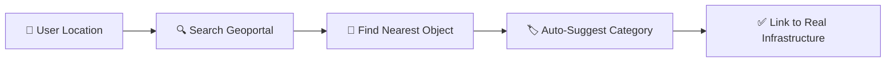

# 🚀 Sign - Pitch Deck

---

## 🏆 Title Slide

<div align="center">

# **Sign**
### Fuqarolar Portali — Citizen Voice Platform

**Connecting 37 Million Citizens to Infrastructure Data**

*IDEATHON 2026*

</div>

---

## 📊 The Problem

### Uzbekistan's Infrastructure Scale (2025)

| 🏛️ Indicator | 📈 Value |
|:-------------|:---------|
| 👥 Population | **37+ million** |
| 🏫 Schools | **10,943** institutions |
| 🏥 Hospitals | **1,972** institutions |
| 🛣️ Roads | **42,400 km** |
| 👨‍🎓 Students | **6.8 million** |
| 💧 Water Systems | **1,000+** objects |

### ❌ Critical Challenges

| Challenge | Impact |
|:----------|:-------|
| 🔴 **Bureaucratic Barriers** | Citizens avoid reporting due to complexity |
| 🔴 **No Transparency** | Zero feedback on request status |
| 🔴 **Isolated Data** | Geoportal (geoasr.uz) data inaccessible to citizens |
| 🔴 **Low Engagement** | No motivation to participate |

> **50%+ of state budget** goes to social infrastructure, yet citizen feedback remains minimal

---

## 💡 Our Solution: Sign

### Simple 4-Step Process

```
┌─────────────────────────────────────────────────────────────┐
│                                                             │
│   1️⃣ DESCRIBE    →    2️⃣ LOCATION    →    3️⃣ PHOTO    →    4️⃣ SUBMIT   │
│   Voice/Text         GPS + Geoportal      Evidence         + XP Reward   │
│                                                             │
└─────────────────────────────────────────────────────────────┘
```

### ✅ Key Features

| Feature | Benefit |
|:--------|:--------|
| 🎤 **Voice Input** | Accessibility for all ages |
| 📍 **Smart Location** | Auto-detects nearest infrastructure |
| 🗺️ **Geoportal Integration** | Links to 21,000+ real objects |
| 🎮 **Gamification** | XP, levels, rewards for engagement |
| 🌐 **Multi-language** | Uzbek, Russian, English |

---

## 🎯 Target Audience

### Two User Modes

| 👥 Mode | 🎯 Audience | ✨ Features |
|:--------|:------------|:------------|
| 📱 **Simple** | Elderly, beginners | Step-by-step wizard, large buttons |
| 📊 **Analytics** | Tech-savvy users | Interactive map, filters, statistics |

### 💰 Market Opportunity

| Segment | Size | Use Case |
|:--------|:-----|:---------|
| 🏠 Citizens | **37M** | Report infrastructure issues |
| 🏛️ Government | **14 regions** | Data-driven decisions |
| 📈 Analysts | **100+ orgs** | Problem zone visualization |

### 💵 2025 Infrastructure Investment

| Direction | Investment |
|:----------|:-----------|
| 🤝 PPP Projects | **$4.5 Billion** |
| 🌍 FDI Target | **$43 Billion** |
| 🏦 ADB Projects | **$3.5 Billion** |

---

## 🗺️ Geoportal Integration — Our Unique Value

### 📍 How It Works



### 🎯 Geoportal Data Coverage

| Object Type | Count | Data Source |
|:------------|:------|:------------|
| 🏫 Schools | **10,943** | geoasr.uz |
| 🏥 Hospitals/Clinics | **1,972** | geoasr.uz |
| 💧 Water Systems | **1,000+** | geoasr.uz |
| ⚽ Sports Facilities | **500+** | geoasr.uz |
| 🛣️ Roads | **42,400 km** | geoasr.uz |

### 🆕 Upcoming Geoportal Features

| Feature | Description | Status |
|:--------|:------------|:-------|
| 🔄 **Real-time Sync** | Live data from geoasr.uz API | 🔜 Planned |
| 📊 **Object Analytics** | Historical data per object | 🔜 Planned |
| 🔔 **Proximity Alerts** | Notify nearby infrastructure issues | 🔜 Planned |
| 🗂️ **Project Tracking** | Link requests to PPP/FDI projects | 🔜 Planned |
| 📈 **Trend Analysis** | Problem patterns by region/type | 🔜 Planned |

---

## ✅ Requirements Compliance

| Requirement | Implementation |
|:------------|:---------------|
| ✅ **Citizen Feedback** | 4-step wizard + photo + status tracking |
| ✅ **Data Visualization** | Interactive map + charts + color-coded statuses |
| ✅ **Microtasks** | XP for every action + progress tracking |
| ✅ **Gamification** | Points, levels, streaks, achievements |
| ✅ **Accessibility** | PWA, responsive design, voice input |

---

## 🛠️ Technical Stack

| Layer | Technology |
|:------|:-----------|
| 🎨 Frontend | HTML5, CSS3, Vanilla JavaScript |
| 📱 PWA | Service Worker, Web App Manifest |
| 🗺️ Maps | Leaflet.js + OpenStreetMap |
| 📊 Data | Geoportal CSV (21,000+ objects) |
| 🌐 i18n | Custom localization (UZ/RU/EN) |

### ⚡ Advantages

- ✅ Zero framework dependencies
- ✅ Fast loading (<2s)
- ✅ Works offline
- ✅ Easy deployment

---

## 📅 Roadmap

### Q1 2026 — MVP ✅
- PWA with wizard
- Telegram Bot UI
- Geoportal integration
- Multi-language support

### Q2 2026 — Backend
- REST API (Node.js/Python)
- PostgreSQL database
- Real authentication

### Q3 2026 — Scale
- Mobile apps (iOS/Android)
- Push notifications
- Gov services integration
- **Geoportal API real-time sync**

---

## 🏁 Conclusion

### Why Sign?

| ✅ Advantage | Impact |
|:-------------|:-------|
| 🎯 **Simplicity** | 4 steps to submit a request |
| 🗺️ **Geoportal** | Auto-links to 21,000+ objects |
| 🎮 **Gamification** | Motivates 37M citizens |
| 📱 **Accessibility** | PWA + Telegram Bot |
| 💰 **Relevance** | $4.5B infrastructure investments |

---

<div align="center">

# 🙏 Thank You!

**Sign** — The Voice of Citizens in Improving Social Infrastructure

**Team:** Sign  
🌐 [Demo PWA](./pwa.html)  
📱 Telegram: @SignBot

---

*IDEATHON 2026*

</div>
